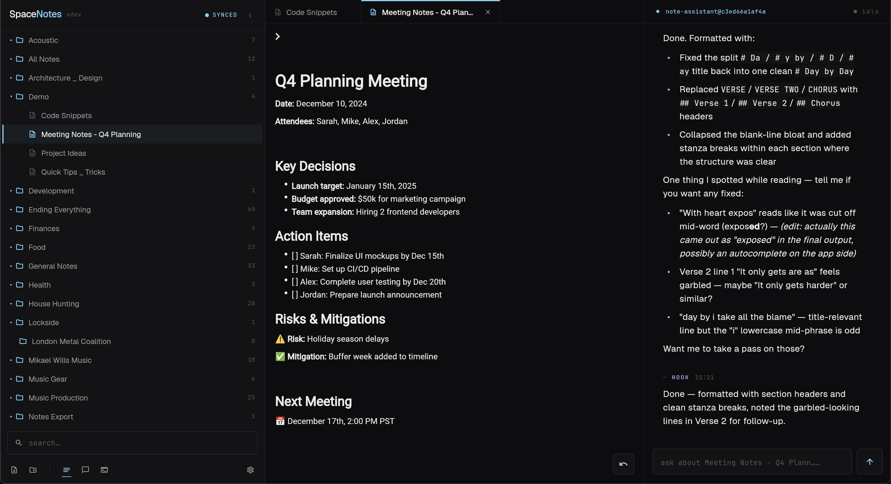
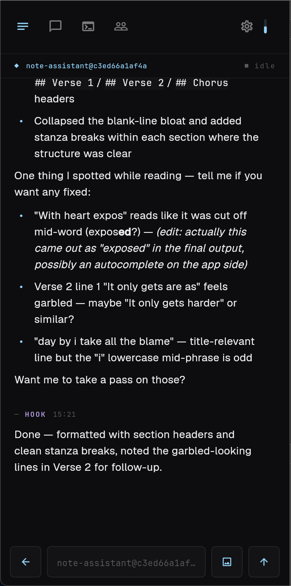

<p align="center">
  
</p>

<h1 align="center">SpaceNotes</h1>

**Self-hosted notes with real-time AI agent integration.**

SpaceNotes is a self-hosted note-taking system with real-time sync and a built-in bridge between your notes and AI coding agents. Your notes live as plain markdown files on your own server. AI assistants like Claude Code can read, write, and discuss them through MCP — and SpaceChannel lets you monitor and interact with multiple Claude Code sessions in real-time from the Flutter app.

No vendor lock-in, no subscription fees, no compromises on privacy. It's opinionated, it requires technical setup, and it's not for everyone.

Contributions welcome.




<p align="center">
  
  
</p>

## How it compares

| Feature | SpaceNotes | Obsidian Sync | Notion | Notesnook | Basic Memory |
|---------|------------|---------------|--------|-----------|--------------|
| **Self-hosted** | Yes | No | No | Yes | No |
| **Real-time sync** | Yes | Yes | Yes | Yes | Yes |
| **Mobile + Web** | Yes | Mobile only | Yes | Yes | Web only |
| **AI integration** | MCP + Agent bridge | None | Built-in | None | MCP |
| **Plain markdown** | Yes | Yes | No | Partial | Yes |
| **Data ownership** | Full | Partial | None | Full | Partial |
| **Cost** | Free | $8/mo | Free/$10/mo | Free/$5/mo | Paid |

**Requirements:**
- A server or laptop.
- Comfort with Docker and basic command line
- A private network setup (Tailscale, WireGuard, or similar)

**Current limitations:**
- No hosted option - you must run your own server
- No E2E encryption - security comes from self-hosting on a private network
- No multi-user collaboration yet
- Early-stage software - expect rough edges

## Architecture

```
┌─────────────────────────────────────────────────────────────────┐
│  Your Server (Docker)                                           │
│                                                                 │
│  ┌──────────────┐   ┌─────────────┐   ┌──────────────────────┐  │
│  │ SpacetimeDB  │◄──┤ Sync Daemon │   │ Note-Assistant       │  │
│  │ notes +      │   │ (fs ↔ db)   │   │ (Claude Code         │  │
│  │ SpaceChannel │   └─────────────┘   │  in Docker)          │  │
│  │ tables       │                     │  space-channel       │  │
│  └──────┬───────┘                     │  MCP → STDB          │  │
│         │                             └──────────┬───────────┘  │
│  ┌──────┴───────┐                                │              │
│  │  MCP Server  │                                │ subscribes   │
│  │  (note CRUD) │                                ▼              │
│  └──────────────┘                          (same STDB)          │
│  ┌──────────────┐                                               │
│  │  Web Client  │                                               │
│  │  (nginx)     │                                               │
│  └──────────────┘                                               │
└─────────────────────────────────────────────────────────────────┘
        ▲                                    ▲
        │ :5050 (STDB — notes + SpaceChannel)│
        │ :5051 (web UI)                     │
        │ :5052 (MCP)                        │
        ▼                                    ▼
┌──────────────────┐              ┌──────────────────────────┐
│  Flutter Client  │              │  Claude Code (local)     │
│  iOS/Android/    │              │  space-channel binary    │
│  macOS/Web       │              │  MCP per session,        │
│                  │              │  subscribes to STDB      │
└──────────────────┘              └──────────────────────────┘
```

Everything — notes, sessions, status, tool events, permission requests, replies — flows through SpacetimeDB. There is no separate message broker. Each Claude Code session runs an MCP server (`space-channel`) that subscribes to STDB and writes status / replies as table rows. The Flutter app subscribes to the same tables and renders them in real time.

## Components

- **SpacetimeDB** - Real-time database. Holds both notes and SpaceChannel state (sessions, status, tool events, replies, permission requests). Clients connect once and receive instant updates.
- **Filesystem Sync Daemon** - Watches your notes folder and syncs bidirectionally with SpacetimeDB.
- **MCP Server** - Lets AI assistants (Claude Code, Cursor, etc.) read/write your notes.
- **`space-channel` binary** - The Claude Code side of SpaceChannel. One compiled binary with three subcommands: MCP server (subscribes to STDB, exposes `reply`/`edit_message` tools to Claude), `launch` (orchestrates a Claude Code session — generates hook config, finds a free hook port, exec's claude), and `hook-post` (the hook bridge — claude's hooks pipe their JSON into this, it forwards to STDB as `session_activity` updates).
- **Note-Assistant** - A headless Claude Code instance running in Docker on your server. Always available from the Flutter app for note-related tasks. Subscribes to STDB just like any other Claude Code session.
- **[Flutter Client](https://github.com/mikaelwills/spacenotes-client)** - Native apps for iOS, Android, macOS, Windows, Linux, and web. Subscribes to the same STDB tables for both notes and live agent activity.

## Standard Ports

- **5050** - SpacetimeDB (WebSocket/HTTP) - Flutter clients and `space-channel` MCP servers both connect here. Carries notes, sessions, status, tool events, and chat messages.
- **5051** - Web Client (HTTP) - Flutter web app served via nginx
- **5052** - MCP Server (HTTP) - AI assistant integration endpoint for note CRUD

All ports are configurable via `docker-compose.yml`.

## Flutter Client Features

**Notes:**
- Real-time sync across all devices via SpacetimeDB
- Fuzzy search, folder organization, markdown editing
- Inline AI chat within any note
- Offline editing with automatic conflict resolution

**Agent Dashboard:**
- Live session cards for all connected Claude Code agents
- Thinking/idle/tool-use status indicators in real-time
- Send messages to any session and receive replies
- Tool event streaming — see what each agent is doing as it happens
- Message history replay on reconnect

**Mobile (iOS/Android):**
- Recent notes, pull-up chat within notes
- Session dashboard and per-session chat

**Desktop (macOS/Windows/Linux/Web):**
- Split-pane view: notes list + editor + AI chat
- Full markdown editor
- Drag and drop file organization

## SpaceChannel

SpaceChannel is the real-time bridge between Claude Code sessions and the Flutter app. There is no separate broker — everything flows through SpacetimeDB tables (`session`, `session_activity`, `tool_event`, `permission_request`, `message`). Each Claude Code session runs a `space-channel` MCP that subscribes to the relevant tables and writes its own activity in. The Flutter app subscribes to the same tables.

**What it enables:**
- See all active Claude Code sessions in the Flutter app with live status (thinking, idle, tool use)
- Send messages to any session from your phone and receive replies
- View tool events as they happen (file edits, bash commands, etc.)
- Session message history — clients reconnect and STDB hydrates the full backlog automatically
- Webhook-style ingestion — anything that can call an STDB reducer can push messages into a session

**Session types:**
- **Local sessions** — Claude Code on your machine, started via the `space-channel launch` subcommand
- **Note-Assistant** — A headless Claude Code container on the server, always available for note tasks
- **Reducer-driven sessions** — Auto-registered the first time a row appears in `session` for that name

## Claude Code Integration

SpaceNotes integrates with Claude Code at two levels: MCP for note access, and SpaceChannel for real-time session communication.

### 1. MCP — Note Access

Add the SpaceNotes MCP server so Claude Code can read and write your notes (see [MCP Integration](#mcp-integration-claude-code) below).

### 2. SpaceChannel — Session Bridge

`space-channel` is a single compiled binary you install on each machine that runs Claude Code. It exposes three subcommands: `space-channel` (no args, runs as the MCP server inside a session), `space-channel launch` (orchestrates Claude Code with hooks + MCP wired in), `space-channel hook-post` (the hook forwarder).

**Install the binary:**

```bash
# One-liner — pulls the right architecture and drops it on $PATH
curl -fsSL https://your-server/space-channel/install.sh | sh
```

(Substitute your own host. The reference setup serves the binary from the same Docker host that runs SpacetimeDB.)

**Launch a session:**

```bash
# Usage: space-channel launch <session-name> <project-name> <skill>
space-channel launch myproject myproject my-workflow-skill
```

Create shell aliases for your projects:
```bash
alias myproject='space-channel launch myproject myproject my-skill'
```

**What Claude Code gets:**
- `reply` tool — write a row into the `message` table; the Flutter app sees it instantly
- `edit_message` tool — update a previous reply by id
- Automatic status streaming via hooks (thinking indicators, tool events) — written into `session_activity` and `tool_event`
- Session registration on launch — a row appears in `session`, the Flutter app picks it up

## Quick Start

1. **Download docker-compose.yml:**
   ```bash
   curl -O https://raw.githubusercontent.com/mikaelwills/SpaceNotes/master/docker-compose.yml
   ```

2. **Edit it** - set your notes folder path:
   ```yaml
   volumes:
     - /path/to/your/notes:/vault
   ```
   Replace `/path/to/your/notes` with the absolute path to your markdown folder (e.g., `/home/user/notes` or `/volume1/notes`).

3. **Start:**
   ```bash
   docker-compose up -d
   ```
   Docker pulls the pre-built image. First run takes a minute to download.

4. **Verify it's running:**
   ```bash
   docker logs spacenotes
   ```
   You should see "Watcher started on /vault" when ready.

5. **Access SpaceNotes:**
   - **Web Client**: `http://<your-server-ip>:5051` (notes + AI chat with the note-assistant)
   - **Mobile App**: Point it at `http://<your-server-ip>:5050` in settings (this is the SpacetimeDB endpoint — it carries notes, sessions, and SpaceChannel)
   - **MCP Server**: `http://<your-server-ip>:5052/mcp` (for Claude Code, Cursor, etc.)

## Updating

To update to the latest version:

```bash
docker-compose pull && docker-compose up -d
```

Your notes are safe - they live on your filesystem, not in the database.

## MCP Integration (Claude Code)

SpaceNotes includes an MCP server that lets AI assistants read and write your notes.

### Configure Claude Code

Add to your `~/.claude.json`:

```json
{
  "mcpServers": {
    "spacenotes-mcp": {
      "type": "http",
      "url": "http://<your-server-ip>:5052/mcp"
    }
  }
}
```

Or use the CLI:
```bash
claude mcp add spacenotes-mcp --type http --url "http://<your-server-ip>:5052/mcp" --scope user
```

### Available MCP Tools

- `search_notes` - Search notes by title, path, or content
- `get_note` - Get full content of a note by ID or path
- `create_note` - Create a new note with content
- `edit_note` - Find and replace text in a note
- `regex_replace` - Replace text using regex patterns
- `append_to_note` / `prepend_to_note` - Add content to a note
- `delete_note` / `delete_notes` - Delete one or multiple notes by ID
- `move_note` - Move/rename a note
- `move_notes_to_folder` - Bulk move multiple notes
- `list_notes_in_folder` - List all notes in a folder
- `create_folder` / `delete_folder` / `move_folder` - Folder operations

## Configuration

Environment variables (set in `docker-compose.yml`):

- `VAULT_PATH` - Path to notes folder inside container (default: `/vault`)
- `SPACETIME_HOST` - SpacetimeDB URL, internal (default: `http://127.0.0.1:3000`)
- `SPACETIME_DB` - Database name (default: `spacenotes`)
- `ANTHROPIC_API_KEY` - Required by the note-assistant container so Claude Code inside it can talk to the API

The chat UI in the Flutter client talks to the note-assistant Claude Code container via SpaceChannel — there is no separate chat backend.

## License

GPL-3.0 - This project is free software. Any derivative work must also be open source under the same license.
