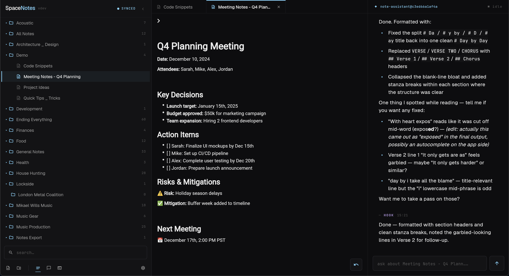
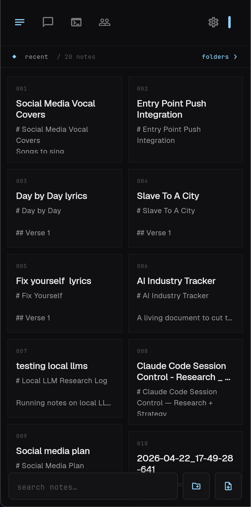

<p align="center">
  
</p>

<h1 align="center">SpaceNotes</h1>

**Yet another note-taking system... 🙄**

But — notes, files and passwords synced across all your devices in real time. No cost. No Obsidian. No cloud. No storage limits.

Your vault is plain files on your own filesystem — markdown notes, media, PDFs, a `pass`-compatible password store — portable, no lock-in, no subscription, nothing to migrate off if you ever want to walk away. A built-in MCP server lets AI assistants like Claude Code and Cursor read and write it.

Contributions welcome.



<p align="center">
  
</p>

## How it compares

| Feature | SpaceNotes | Obsidian Sync | Notion | Notesnook | Basic Memory |
|---------|------------|---------------|--------|-----------|--------------|
| **Self-hosted** | Yes | No | No | Yes | No |
| **Real-time sync** | Yes | Yes | Yes | Yes | Yes |
| **Mobile + Web** | Yes | Mobile only | Yes | Yes | Web only |
| **AI integration** | MCP | None | Built-in | None | MCP |
| **Plain files** | Yes | Yes | No | Partial | Yes |
| **Data ownership** | Full | Partial | None | Full | Partial |
| **Cost** | Free | $8/mo | Free/$10/mo | Free/$5/mo | Paid |

**Requirements:**
- A server or laptop.
- Comfort with Docker and basic command line
- A private network setup (Tailscale, WireGuard, or similar)

**Current limitations:**
- No hosted option - you must run your own server
- No E2E encryption for notes - security comes from self-hosting on a private network (passwords are GPG-encrypted at rest)
- No multi-user collaboration yet
- Early-stage software - expect rough edges

## Architecture

One Docker container on your server runs everything:

- **SpacetimeDB** holds the notes: file metadata and markdown content.
- **The sync daemon** keeps the vault folder and SpacetimeDB in step in both directions, and serves every file byte over HTTP.
- **The MCP server** gives AI assistants read/write access to the vault.
- **nginx** serves the web client and proxies `/files`, `/thumbnails` and `/uploads` to the daemon.

The **Flutter client** (iOS, Android, macOS, Windows, Linux, web) subscribes to SpacetimeDB for notes and talks to the daemon over HTTP for file bytes.

The vault on disk is the ground truth. The database can be wiped and rebuilt from it; a note's identity (its UUID) is kept in the daemon's own journal, so vault files stay byte-for-byte what you wrote, with nothing injected into them.

## Components

- **SpacetimeDB** - Real-time database holding the notes. Clients connect once and receive instant updates.
- **Filesystem sync daemon** - Watches the vault and syncs bidirectionally with SpacetimeDB. Also the file server: ranged downloads, resumable uploads, and video/image thumbnails (ffmpeg).
- **MCP server** - Lets Claude Code, Cursor and other assistants search, read, write and organise the vault, and hand large files in and out.
- **[Flutter client](https://github.com/mikaelwills/spacenotes-client)** - Native apps for iOS, Android, macOS, Windows, Linux, and web.

## Standard Ports

- **5050** - SpacetimeDB (WebSocket/HTTP). The Flutter client connects here.
- **5051** - HTTP: the web client, plus `/files/` (downloads, whole-file uploads), `/uploads` (resumable uploads) and `/thumbnails/`.
- **5052** - MCP server (HTTP), `/mcp`.

All ports are configurable via `docker-compose.yml`.

## Files, downloads and uploads

The vault isn't only markdown. Images (jpg, png, gif, webp, heic), audio (mp3, wav, m4a, aac, flac, ogg), video (mp4, mov, m4v, webm), PDFs and `.gpg` files are all first-class; anything else is ignored.

- **Large files never go through the database.** Binaries under 20KB are stored inline; anything bigger is a few hundred bytes of metadata in SpacetimeDB, with the bytes on disk and served over HTTP. An 80MB video doesn't touch the commitlog.
- **Downloads are on demand and resumable.** Opening a file downloads it to the device and caches it; an interrupted download resumes from where it stopped via HTTP `Range`. A download that slows to a crawl reconnects itself, and reopening a file cancels any stale transfer before resuming. Downloads are verified by size and SHA-256 before they count as complete.
- **Offloading.** Downloaded files can be offloaded from the device (Settings → downloaded files) and fetched again when needed.
- **Uploads are resumable.** Files over 8MB go up in 4MB chunks over a tus-style protocol (`POST`/`HEAD`/`PATCH /uploads`). An upload survives the app being backgrounded or killed and continues on next launch from the server's offset.
- **No silent overwrites.** Uploading onto an existing name is refused (HTTP 409) by the server, not the client, so it holds even before the app has synced.
- **Thumbnails** are generated server-side for images and video.
- **Multiple files at once.** Multi-select in the file grid to move or delete several files together.

The web client is notes-only: downloading and uploading binary files needs a native app.

## Password manager

SpaceNotes can hold a [`pass`](https://www.passwordstore.org/)-compatible password store: GPG-encrypted `.gpg` files under `.password-store/` in the vault, synced like any other file.

- Import your GPG private key on each device (Settings → password manager) to reveal passwords. The key stays on that device; the server only ever sees ciphertext.
- Browse and search credentials from the key icon in the nav, view/copy fields, and create new entries with a built-in password generator.
- The whole feature can be switched off per device (Settings → preferences), which removes it from the nav, the desktop sidebar and settings.

## Flutter Client Features

**Notes and files:**
- Real-time sync across all devices via SpacetimeDB, with an offline cache
- Recents page: **Recently Viewed** (what this device opened, tracked locally) and **Recently Updated** (what changed in the vault)
- Fuzzy search, folders, favourite folders, masonry grid of file cards
- Markdown editing; generative-UI "dashboard" notes (KPIs, charts, editable fields)
- Viewers for images and video; PDFs and other files download to the device
- Audio player with a native parametric EQ, scrolling waveform scrubber, background/lock-screen playback and a persistent mini player

**Mobile (iOS/Android):**
- Recents, folders and passwords one tap apart in the nav bar

**Desktop (macOS/Windows/Linux/Web):**
- Finder-style layout: sidebar and tabbed notes with back navigation
- Drag and drop file organisation, keyboard navigation (Shift+Tab cycles screens)

## Quick Start

1. **Download docker-compose.yml:**
   ```bash
   curl -O https://raw.githubusercontent.com/mikaelwills/SpaceNotes/master/docker-compose.yml
   ```

2. **Edit it** - set your notes folder and the address clients reach the server on:
   ```yaml
   volumes:
     - /path/to/your/notes:/vault
   environment:
     - DATA_DIR=/data
     - SPACENOTES_FILES_HOST=http://<your-server-ip>:5051
   ```
   `SPACENOTES_FILES_HOST` is required: the MCP server hands URLs on this host to AI assistants for file transfers, so it must be the address your other machines use (e.g. the server's Tailscale IP). The MCP server won't start without it.

3. **Start:**
   ```bash
   docker-compose up -d
   ```
   Docker pulls the pre-built image. First run takes a minute to download.

4. **Verify it's running:**
   ```bash
   docker logs spacenotes
   ```
   You should see "Watcher started on /vault" when ready.

5. **Access SpaceNotes:**
   - **Web client**: `http://<your-server-ip>:5051`
   - **Mobile/desktop app**: enter `<your-server-ip>` in Settings → server
   - **MCP server**: `http://<your-server-ip>:5052/mcp`

## Updating

```bash
docker-compose pull && docker-compose up -d
```

Your notes are safe - they live on your filesystem, not in the database. Keep the named volumes: `spacetime-config` holds the database owner identity (lose it and the module can't be republished), and `spacenotes-daemon-data` holds the note identity journal.

## MCP Integration (Claude Code)

### Configure Claude Code

```bash
claude mcp add spacenotes-mcp --type http --url "http://<your-server-ip>:5052/mcp" --scope user
```

Or add to `~/.claude.json`:

```json
{
  "mcpServers": {
    "spacenotes-mcp": {
      "type": "http",
      "url": "http://<your-server-ip>:5052/mcp"
    }
  }
}
```

### Available MCP Tools

**Find and read:**
- `search_files` - search by title, path or content
- `search_files_content` - search and return excerpts around matches
- `get_file` / `get_files` - full content of one or several files, by id or path (optionally one heading or a line range)
- `list_folder` - immediate subfolders and files of a folder
- `vault_index` - every folder path, plus files under chosen folders
- `get_backlinks` / `get_outbound_links` - link graph for a note

**Write:**
- `create_file` - create a note
- `edit_file` - find-and-replace, one or many edits in one commit
- `regex_replace`, `replace_across_files` - pattern replace in one note or across many
- `append_to_file` / `prepend_to_file`

**Organise:**
- `move_file`, `move_files_to_folder`
- `delete_file`, `delete_files`
- `create_folder`, `move_folder`, `delete_folder`, `empty_folder`

**Binary files:**
- `upload_file` / `download_file` - return a plain HTTP URL; the assistant moves the bytes itself (`curl -T` / `curl -o`), so large files never pass through a tool call

## Configuration

Environment variables (set in `docker-compose.yml`):

- `SPACENOTES_FILES_HOST` - **required**. Externally reachable base URL of port 5051, used in `upload_file`/`download_file` URLs
- `DATA_DIR` - daemon state (note identity journal); point at the `/data` volume
- `VAULT_PATH` - path to the vault inside the container (default: `/vault`)
- `SPACETIME_HOST` - SpacetimeDB URL, internal (default: `http://127.0.0.1:3000`)
- `SPACETIME_DB` - database name (default: `spacenotes`)

## License

GPL-3.0 - This project is free software. Any derivative work must also be open source under the same license.
